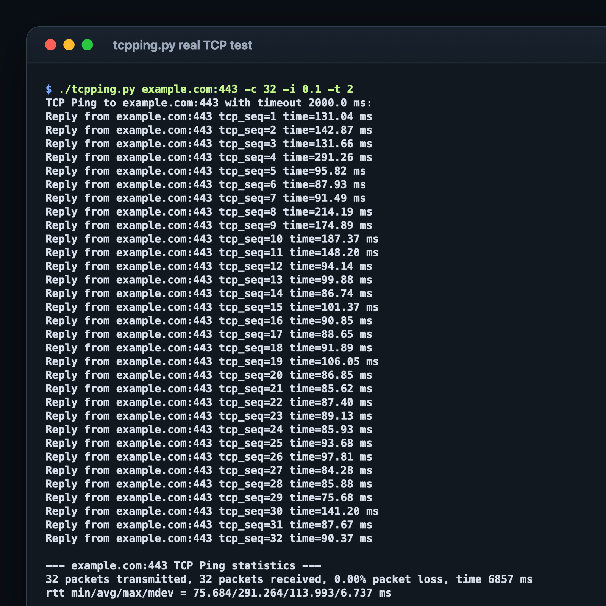
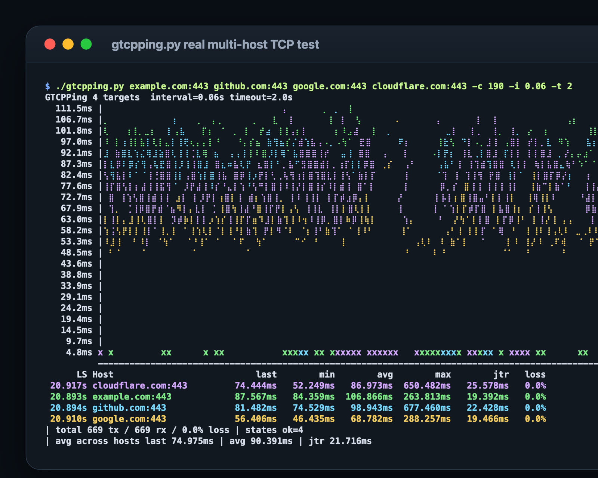

# TCP Ping Utility

`tcpping` is a simple command-line utility designed to test the connectivity of a specific host by sending TCP packets. It is a useful tool for diagnosing network issues and verifying the availability of network services.

## Features

- **TCP Based:** Unlike traditional ICMP ping, `tcpping` utilizes TCP to check the status of a host.
- **Customizable Options:** Specify the port, number of attempts, interval between pings, and timeout duration.
- **Infinite Attempts:** Option to keep sending requests until manually stopped.

## Installation

You can download the `tcpping.py` file from the project repository. Ensure you have Python installed on your system.

```bash
git clone https://github.com/ArcherGodson/tcpping
cd tcpping
```

## Usage

```bash
./tcpping.py [-h] [-c COUNT] [-i INTERVAL] [-p PORT] [-t TIMEOUT] host[:port]
```

For a live terminal graph similar to `gping`, use:

```bash
./gtcpping.py [-h] [-c COUNT] [-i INTERVAL] [-p PORT] [-t TIMEOUT] [-s {ls,host,last,min,avg,max,jtr,loss}] [--descending] host[:port] [host[:port] ...]
```

`gtcpping.py` supports the core `tcpping.py` options, adds multi-target plotting
and startup table sorting, draws recent TCP latency as a Braille terminal graph,
shows per-target latency and loss in a sortable table, and keeps aggregate
statistics visible in the bottom two lines.

Multiple targets can be plotted at once:

```bash
./gtcpping.py example.com:443 github.com:443 -i 0.5
```

When multiple targets are provided, `gtcpping.py` checks them in parallel so a
slow or timed out host does not block the others.

The table can be sorted at startup:

```bash
./gtcpping.py example.com:443 github.com:443 --sort loss --descending
```

While running, use hotkeys to sort the table: `l` LS, `h` host, `t` last,
`n` min, `a` avg, `x` max, `j` jtr, `o` loss, and `d` to toggle direction.

### Positional Arguments

- `hosts`  
  One or more Host[:port] values to TCP Ping.

### Options

- `-h, --help`  
  Show this help message and exit.
  
- `-c COUNT, --count COUNT`  
  Number of attempts (default: infinite).
  
- `-i INTERVAL, --interval INTERVAL`  
  Interval in seconds between sending each packet (default: 1).
  
- `-p PORT, --port PORT`  
  Port to TCP Ping (default: 80).
  
- `-t TIMEOUT, --timeout TIMEOUT`  
  Timeout in seconds (default: 3).

## Example

```bash
./tcpping.py example.com -c 5 -p 443
```
or
```bash
./tcpping.py example.com:443 -c 5 -i 0.2
```


## Screenshots

### tcpping.py



### GTCPPing



## License

This project is licensed under the MIT License. See the LICENSE file for more details.

## Contributing

Contributions are welcome! Please submit a pull request or open an issue for any suggestions or improvements.

---
